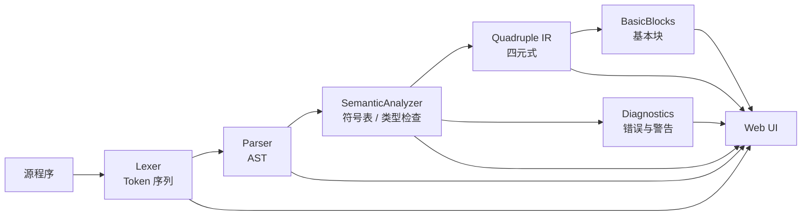
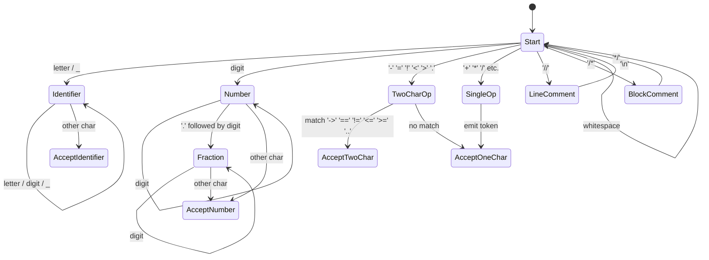

# 类 Rust 中间代码生成器

一个面向同济大学编译原理课程大作业 2 的类 Rust 编译前端。项目从源程序出发，完成词法分析、递归下降语法分析、静态语义检查，并生成四元式形式的中间代码；同时提供纯前端图形界面用于查看诊断、Token、AST、符号表与中间代码。

本仓库基于初版重新整理过，按 ES Module 组织代码，主要改进点见 [改进点速览](#改进点速览)。

## 目录

- [类 Rust 中间代码生成器](#类-rust-中间代码生成器)
  - [目录](#目录)
  - [项目概述](#项目概述)
  - [功能特性](#功能特性)
  - [改进点速览](#改进点速览)
  - [环境要求](#环境要求)
  - [快速开始](#快速开始)
  - [项目结构](#项目结构)
  - [词法分析](#词法分析)
    - [Token 分类](#token-分类)
    - [DFA 设计](#dfa-设计)
  - [语法分析](#语法分析)
    - [文法规则覆盖](#文法规则覆盖)
    - [表达式优先级与左递归消除](#表达式优先级与左递归消除)
    - [Panic-mode 错误恢复](#panic-mode-错误恢复)
    - [元组类型的修复](#元组类型的修复)
  - [语义检查与中间代码](#语义检查与中间代码)
    - [语义检查清单](#语义检查清单)
    - [类型推断与符号表](#类型推断与符号表)
    - [四元式设计](#四元式设计)
    - [基本块切分](#基本块切分)
  - [控制流的四元式翻译模板](#控制流的四元式翻译模板)
    - [函数定义](#函数定义)
    - [if / else 语句](#if--else-语句)
    - [while 循环](#while-循环)
    - [for 循环（左闭右开区间）](#for-循环左闭右开区间)
    - [loop 无限循环](#loop-无限循环)
    - [loop 表达式](#loop-表达式)
    - [函数调用](#函数调用)
  - [图形界面](#图形界面)
  - [测试用例](#测试用例)
  - [设计思考](#设计思考)
  - [参考文献](#参考文献)

## 项目概述

课程要求是根据类 Rust 语义规则，对源程序给出语义分析结果，并生成中间代码，建议使用四元式。当前实现把编译流程拆成 5 个阶段：

1. **词法分析** Lexer：把源程序扫描成 Token 序列，支持错误恢复，单趟扫描可一次报告多个词法错误。
2. **语法分析** Parser：递归下降构造 AST，使用 panic-mode 错误恢复在错误处同步到下一条语句或下一个函数，避免单错即终止。
3. **语义分析** SemanticAnalyzer：维护函数表、作用域栈和符号表，检查类型、声明、赋值、返回、循环控制和借用规则。
4. **中间代码生成**：在语义遍历过程中同步发射四元式，临时变量与标签按函数独立编号。
5. **可视化展示**：在浏览器中展示诊断、四元式（列表 / 基本块两种视图）、符号表、Token 和 AST。



## 功能特性

- 支持函数声明、参数、返回类型、语句块、空语句、返回语句。
- 支持变量声明、类型标注、类型推断、初始化、赋值和变量重影。
- 支持 `i32`、`bool`、数组、元组、不可变引用和可变引用。
- 支持整数 / 布尔字面量、变量、括号、块表达式、函数调用。
- 支持算术、比较、一元负号、逻辑非、取引用与解引用；`==` / `!=` 仅允许在可比较类型 (`i32` / `bool` / `&T`) 上使用。
- 支持 `if`、`else`、`else if`、`while`、`for start..end`、`loop`、`break`、`continue`。
- 支持 `if` 表达式、块尾表达式、`loop { break value; }` 表达式。
- 支持数组字面量、数组索引、元组字面量、元组成员访问与元素赋值。
- 输出 `FUNC`、`PARAM`、`DECL`、`ASSIGN`、算术 / 比较、`IF_FALSE`、`GOTO`、`LABEL`、`ARG`、`CALL`、`RETURN` 等四元式。
- 提供浏览器 UI，可查看诊断、四元式（列表 + 基本块视图）、符号表、Token 和 AST，并支持源代码行号显示、诊断点击跳转、IR 导出为 TXT。

## 改进点速览

相对初版，本仓库做的主要改动：

| # | 类别 | 改进内容 |
| --- | --- | --- |
| 1 | **修复** | 元组类型 `(T; U)` 不再被误判为合法，匹配 PDF 9.1 反例 `let b:(i32;i32;)` 的语义；新增 `(T,)` 单元素元组与 `(T)` 括号类型的明确区分。 |
| 2 | **正确性** | `==` / `!=` 仅允许 `i32` / `bool` / 引用类型，对数组和元组直接比较时报错，避免假装通过。 |
| 3 | **正确性** | 除法右侧为字面量 `0` 时输出 warning，避免后续生成的 IR 被静默接受。 |
| 4 | **错误恢复** | 词法和语法阶段都加入恢复机制：词法跳过非法字符继续扫描，语法用 panic-mode 同步到下一个 `;` / `}` / `fn`，一次编译可报告多个错误。 |
| 5 | **IR 可读性** | 临时变量 `_tN` 和标签 `LN` 在每个函数进入时重置编号；多函数程序的 IR 不再出现跨函数串号问题。 |
| 6 | **可视化** | 编辑器加行号列，诊断条目可点击跳转到对应源代码位置，Token 和符号表行也支持跳转；四元式新增「列表」与「基本块」两种视图，并可一键导出为 TXT。 |
| 7 | **工程性** | 重构为 ES Module（`src/lexer.js`、`src/parser.js`、`src/semantic.js` 等），浏览器和 Node 共用同一份模块代码，不再需要桥接脚本。 |
| 8 | **测试** | 测试改成收集式 runner，逐项打印通过 / 失败统计；用例从初版的约 30 项扩到 41 项，覆盖修复项和错误恢复。 |

详细说明分散在下文相应章节。

## 环境要求

- 浏览器：Chrome、Edge、Firefox 等支持 ES Module 的现代浏览器。
- 运行测试：Node.js 18 或更高版本。
- 项目运行不需要 `npm install`，也没有构建步骤。

## 快速开始

**最简单的方式：直接双击 `index.html`。**

页面已经引入了打包后的 `dist/compiler.bundle.js`，浏览器在 `file://` 协议下也能加载运行，不需要任何服务器或安装步骤。

如果你修改了 `src/` 下的源码，需要重新生成 bundle：

```bash
node build.js
```

也可以走 ES Module 开发模式（修改源码后无需重新打包）。这种模式下浏览器要求 `http://` 协议，所以需要起一个本地服务器：

```bash
# 任选其一
python3 -m http.server 8000
# 或
npx http-server -p 8000
```

然后访问 `http://localhost:8000/index.html?dev`，再把 `index.html` 里的 `<script src="dist/...">` 临时替换成 `<script type="module" src="src/main.js">` 即可。日常使用推荐第一种方式。

使用流程：

1. 在左侧编辑器输入类 Rust 源程序，或选择内置示例后点击「载入示例」。
2. 点击「编译分析」（或按 `Ctrl/Cmd + Enter`）。
3. 在右侧切换查看「诊断」「四元式」「符号表」「Token」「AST」。
4. 点击诊断条目可跳转到对应源代码行；在「四元式」面板可切换「列表 / 基本块」并导出 TXT。

运行自动测试：

```bash
node tests/run-tests.js
```

测试运行器会逐项打印通过情况，类似：

```text
运行 41 项测试…

  ✓ 基础函数调用与 while
  ✓ if / else 返回
  ...
  ✓ 【新增】单元素元组类型 (T,) 与括号类型 (T) 区分

通过 41 / 41，失败 0
```

## 项目结构

```text
.
├── index.html                                  # 图形界面入口（引入 dist 下的 bundle）
├── styles.css                                  # 页面样式
├── build.js                                    # 把 src/ 下的 ESM 拼成单文件 bundle
├── package.json                                # 声明 ES Module 模式
├── dist/
│   └── compiler.bundle.js                      # 打包后的脚本，供 file:// 直接使用
├── src/
│   ├── main.js                                 # 浏览器 ESM 入口（开发模式用）
│   ├── ui.js                                   # UI 事件绑定 + 渲染
│   ├── compile.js                              # 编译入口，串起三阶段
│   ├── lexer.js                                # 词法分析 + 错误恢复
│   ├── parser.js                               # 递归下降语法分析 + panic-mode
│   ├── semantic.js                             # 语义检查 + IR 生成
│   ├── types.js                                # 类型系统
│   ├── ir.js                                   # 基本块切分、IR 文本格式化
│   └── samples.js                              # 内置示例
├── tests/
│   └── run-tests.js                            # 自动化回归测试
├── README.md                                   # 本文档
└── 【Rust版】大作业2：中间代码生成器.pdf       # 课程任务书
```

## 词法分析

### Token 分类

| 类别 | 示例 | 说明 |
| --- | --- | --- |
| 关键字 | `fn`、`let`、`mut`、`return`、`if`、`else`、`while`、`for`、`loop`、`break`、`continue`、`true`、`false` | 由关键字表统一判定 |
| 标识符 | `main`、`value`、`sum_1` | 字母或下划线开头，后续可含数字 |
| 数字 | `0`、`123`、`0.1` | 整数字面量进入 `i32`，浮点字面量被诊断为不支持 |
| 运算符 | `+`、`-`、`*`、`/`、`==`、`!=`、`<=`、`>=`、`..`、`&`、`!` | 包含一元、二元和范围运算 |
| 界符 | `{}`、`()`、`[]`、`;`、`,`、`:`、`.` | 用于结构化语法 |
| EOF | `<eof>` | 语法分析结束标记 |

### DFA 设计

下图是词法扫描的状态转移示意：



关键处理策略：

- 先跳过空白、行注释 `//` 和块注释 `/* ... */`，块注释未闭合记录词法错误。
- 双字符符号 `->`、`==`、`!=`、`<=`、`>=`、`..`、`&&`、`||` 优先匹配，避免被拆成两个单字符。
- Token 记录行列号，后续语法错误和语义错误都能定位到源程序位置。
- 浮点字面量在词法阶段被识别，是否支持由语义阶段给出诊断。
- **错误恢复**：遇到非法字符时把错误记入 `errors`、跳过该字符继续扫描，不再因为一个非法字符就中断整次编译。

## 语法分析

### 文法规则覆盖

| 规则 | 要求 | 状态 |
| --- | --- | --- |
| 0.1 | `mut` 变量属性 | 已完成 |
| 0.2 | `i32` 类型 | 已完成，并扩展 `bool`、引用、数组、元组 |
| 0.3 | 左值与标识符元素 | 已完成，扩展索引、成员、解引用 |
| 1.1 - 1.5 | 函数、语句块、空语句、return、参数、返回类型 | 已完成 |
| 2.0 - 2.2 | 变量声明、声明语句、赋值语句 | 已完成 |
| 3.1 - 3.5 | 基本表达式、比较、加减、乘除、函数调用 | 已完成 |
| 4.1 | if 选择结构 | 已完成 |
| 5.0 - 5.1 | 循环语句、while | 已完成 |
| 4.2 - 4.3 | else、else if | 扩展完成 |
| 5.2 - 5.4 | for、loop、break / continue | 扩展完成 |
| 6.1 - 6.4 | 不可变变量、引用、可变引用、解引用 | 扩展完成基础静态检查 |
| 7.0 - 7.4 | 块表达式、函数尾表达式、if 表达式、loop 表达式 | 扩展完成 |
| 8.1 - 8.3 | 数组类型、数组表达式、数组元素 | 扩展完成 |
| 9.1 - 9.3 | 元组类型、元组表达式、元组元素 | 扩展完成 |

### 表达式优先级与左递归消除

表达式采用分层解析：

```text
parseExpression
└── parseComparison      < <= > >= == !=
    └── parseTerm        + -
        └── parseFactor  * /
            └── parseUnary
                └── parsePostfix
                    └── parsePrimary
```

因此 `1 + 2 * 3 < 10` 会先归约乘法，再归约加法，最后生成比较表达式。

课程文法中常见左递归：

```text
<加减表达式> -> <加减表达式> <加减运算符> <项>
```

递归下降不能直接处理左递归，因此实现中转换为循环：

```javascript
let expression = this.parseFactor();
while (this.check("+") || this.check("-")) {
  const op = this.advance();
  const right = this.parseFactor();
  expression = { type: "BinaryExpr", operator: op.value, left: expression, right };
}
```

这样既消除了左递归，又保持了左结合语义。

### Panic-mode 错误恢复

旧实现遇到第一处语法错误就抛出异常终止解析，对用户不够友好。新实现的 `Parser` 增加两个同步点：

- **`synchronizeToStatement`**：在 `parseBlock` 内层捕获异常，记录到 `errors`，然后跳过 token 直到看到 `;` 或匹配出当前块的 `}`，接着继续解析块内的下一条语句。
- **`synchronizeToFunction`**：在 `parseProgram` 顶层捕获异常，跳过 token 直到下一个 `fn` 关键字或文件末尾，从而保证一个函数解析失败不会拖累后续函数。

例如下面的源代码会一次报出多处缺少 `;` 的错误，而不是只看到第一条：

```rust
fn main() {
    let mut a = 1     // 缺少 ;
    let mut b = 2;
    let c = ;         // 缺少表达式
    let d = 3         // 缺少 ;
}
```

### 元组类型的修复

PDF 9.1 给出反例 `let b:(i32;i32;)`，初版的 `parseType` 用 `while (this.check(",") || this.check(";"))` 把 `;` 也接受为元组类型的分隔符，等于把这条反例当成了合法语法。新版 `parseType` 严格只接受 `,` 作为分隔符，遇到 `;` 直接报错：

```text
语法错误：元组类型元素之间必须使用 ',' 分隔，不能使用 ';'
```

同时显式区分 `(T)`（括号包裹的类型，等价于 `T`）与 `(T,)`（单元素元组），让 `let a:(i32,) = (1,);` 合法且能 `.0` 访问。

## 语义检查与中间代码

语义分析和中间代码生成由 `SemanticAnalyzer` 完成。它在遍历 AST 的同时维护函数表、作用域栈、符号表、临时变量与标签，因此每一条四元式都对应到已经通过语义检查的状态。

整体流程：

1. **收集函数签名**：先扫描所有函数声明，记录函数名、形参类型、形参可变性和返回类型，并检查重复函数声明。
2. **逐函数分析**：每个函数进入独立的作用域，将形参加入符号表后分析语句块；进入时把 `tempId` 和 `labelId` 归零，使临时变量和标签按函数独立编号。
3. **检查语义约束**：对声明、赋值、表达式、函数调用、控制流和复合类型执行静态检查。
4. **生成四元式**：在表达式求值、分支跳转、循环控制和函数调用处即时发射 IR。
5. **输出结果**：返回诊断列表、符号表和四元式表，供命令行测试和浏览器 UI 共用。

### 语义检查清单

| 检查类别 | 实现内容 | 示例错误 |
| --- | --- | --- |
| 声明检查 | 变量必须先声明后使用；函数调用必须能在函数表中找到 | `变量 'a' 未声明` |
| 初始化检查 | 变量读取前必须已经赋值；无类型声明的变量必须能推断出类型 | `变量 'x' 使用前未赋值` |
| 类型检查 | 赋值、变量初始化、return、函数实参、数组 / 元组元素类型必须一致 | `赋值类型不一致` |
| 返回检查 | `return` 或函数尾表达式必须匹配函数声明返回类型 | `返回值类型不一致` |
| 条件检查 | `if`、`while` 的条件必须是 `bool` | `if 条件表达式必须是 bool` |
| 循环控制检查 | `break`、`continue` 必须在循环体内；`break value` 仅用于 `loop` 表达式 | `break 必须出现在循环体内` |
| 可变性检查 | 不带 `mut` 的变量、数组元素、元组元素不能二次赋值 | `变量不可变，不能被二次赋值` |
| 借用检查 | 多个不可变引用可共存；可变引用必须独占；可变引用只能来自可变变量 | `可变引用不能和其他引用共存` |
| 索引检查 | 数组索引必须是 `i32`；常量索引会检查越界；元组索引必须是整数字面量 | `数组索引必须在合法范围内` |
| **相等比较检查（新）** | `==` / `!=` 仅允许 `i32` / `bool` / `&T`；数组、元组比较直接报错 | `类型 [i32; 3] 不支持 == / != 比较` |
| **除零警告（新）** | 除法右侧为字面量 `0` 时输出 warning | `检测到除以常量 0，运行时将出现除零错误` |

作用域由栈结构维护。进入函数、块表达式或 `for` 循环时压入新作用域，离开时弹出作用域并释放该作用域内变量持有的引用借用。变量重影会隐藏当前作用域中旧的同名绑定并释放旧绑定持有的借用；引用变量重新赋值时也会释放旧借用、登记新借用。

### 类型推断与符号表

未标注类型的变量先以 `unknown` 暂存：

```rust
fn main() {
    let mut x;
    x = 1;
}
```

分析到 `x = 1` 时，右侧类型为 `i32`，于是把 `x` 推断为 `i32`。如果离开作用域时仍为 `unknown`，编译器会报告无法推断类型。

符号表为每个变量记录：

- 源程序名称，例如 `x`。
- IR 名称，例如 `x#1`，用于区分重影变量。
- 所在作用域，例如 `fn main`、`block`、`for`。
- 符号类别，例如 `param`、`local`、`loop`。
- 类型、可变性、初始化状态、读写次数和源码位置。

### 四元式设计

中间代码采用四元式：

```text
(op, arg1, arg2, result)
```

其中 `op` 是操作符，`arg1` 和 `arg2` 是操作数，`result` 是结果位置、跳转目标或函数名。临时变量统一命名为 `_t1`、`_t2`，标签统一命名为 `L1`、`L2`。

> **改进**：临时变量与标签在每个函数进入时重置，多函数程序中不再出现跨函数递增编号，IR 列表更干净。

常见四元式如下：

| 操作 | 含义 |
| --- | --- |
| `FUNC` / `END` | 函数开始与结束 |
| `PARAM` | 函数形参登记 |
| `DECL` | 局部变量声明 |
| `ASSIGN` | 赋值 |
| `+`、`-`、`*`、`/` | 算术运算 |
| `<`、`<=`、`>`、`>=`、`==`、`!=` | 比较运算，结果为 `bool` |
| `NEG`、`NOT` | 一元负号与逻辑非 |
| `IF_FALSE` | 条件为假时跳转 |
| `GOTO` / `LABEL` | 无条件跳转与标签 |
| `ARG` / `CALL` | 函数实参传递与函数调用 |
| `RETURN` | 函数返回 |
| `ARRAY` / `INDEX` | 数组构造与数组取元素 |
| `TUPLE` / `MEMBER` | 元组构造与元组取成员 |
| `REF` / `REF_MUT` / `DEREF` | 不可变引用、可变引用与解引用 |

### 基本块切分

`src/ir.js` 中的 `buildBasicBlocks` 把线性四元式切分成基本块，规则与教材一致：

- 入口（leader）：函数起始 `FUNC`、`LABEL`、跳转 / 返回 / 函数结束指令的下一条；
- 出口：`GOTO`、`IF_FALSE`、`RETURN`、`END`，或下一个入口指令之前。

基本块视图在 UI 上以折叠卡片的形式展示，每个块标注它对应的函数名或起始 LABEL，便于阅读控制流。

## 控制流的四元式翻译模板

下面给出主要控制结构的翻译模板，作为报告里的"中间代码生成原理图"。

### 函数定义

```text
fn name(p1:T1, p2:T2) -> RT { body }
```

```text
(FUNC,     ,    , name)
(PARAM, T1,    , p1#i)
(PARAM, T2,    , p2#j)
... body ...
(RETURN, _t, , )           ; 若函数尾表达式存在
(END,      ,    , name)
```

### if / else 语句

```text
if cond { S1 } else { S2 }
```

```text
... 计算 cond -> t ...
(IF_FALSE, t,     , L_else)
... S1 ...
(GOTO,      ,     , L_end)
(LABEL,     ,     , L_else)
... S2 ...
(LABEL,     ,     , L_end)
```

无 `else` 分支时把 `GOTO L_end` 和 `LABEL L_end` 折叠成单个 `LABEL L_else` 出口。

### while 循环

```text
while cond { body }
```

```text
(LABEL,     ,     , L_start)
... 计算 cond -> t ...
(IF_FALSE, t,     , L_end)
... body ...
(GOTO,      ,     , L_start)
(LABEL,     ,     , L_end)
```

### for 循环（左闭右开区间）

```text
for mut i in start..end { body }
```

```text
... 计算 start -> s, end -> e ...
(ASSIGN, s,    , i#k)
(LABEL,    ,    , L_start)
(<,     i#k, e, _t)
(IF_FALSE, _t,  , L_end)
... body ...
(LABEL,    ,    , L_step)
(+,     i#k, 1, _u)
(ASSIGN, _u,   , i#k)
(GOTO,     ,    , L_start)
(LABEL,    ,    , L_end)
```

`continue` 跳到 `L_step`，`break` 跳到 `L_end`，于是循环变量在 `continue` 时仍会自增。

### loop 无限循环

```text
loop { body }
```

```text
(LABEL,    ,    , L_start)
... body ...
(GOTO,     ,    , L_start)
(LABEL,    ,    , L_end)        ; 仅 break 可达
```

### loop 表达式

`loop` 表达式额外维护 `resultPlace` 来承接 `break value`：

```text
let v = loop {
    if cond { break value1; }
    body
};
```

```text
(LABEL,    ,    , L_start)
... if cond ... break ...
(ASSIGN, value1, , _result)
(GOTO,    ,    , L_end)
...
(GOTO,    ,    , L_start)
(LABEL,    ,    , L_end)
; _result 即 v 的取值
```

如果一个 `loop` 表达式中没有任何可达 `break value`，会发出 warning，并按 `()` 类型处理。

### 函数调用

```text
f(a, b)
```

```text
... 计算 a -> ta, b -> tb ...
(ARG, ta, , )
(ARG, tb, , )
(CALL, f, 2, _t)        ; _t 是返回值临时变量，f 返回 () 时省略
```

## 图形界面

界面由 `index.html` + `styles.css` + `src/ui.js` 提供。

主要视图：

- **源程序编辑区**：左侧有行号列，行号随输入和滚动自动同步；支持 Tab 缩进 4 空格、`Ctrl/Cmd + Enter` 触发编译。
- **示例选择**：内置基础通过、函数与 if、语义错误、错误恢复、break/continue、数组和元组、loop 表达式、引用与借用示例。
- **诊断面板**：按行号排序展示词法 / 语法 / 语义错误与警告；点击任意条目把光标定位到对应源代码行。
- **四元式面板**：默认列表视图，支持切换到「基本块」视图；右上角按钮可将 IR 导出为 TXT。
- **符号表面板**：展示变量作用域、类型、可变性和初始化状态。
- **Token 面板**：展示词法扫描结果，点击行可跳转到源代码。
- **AST 面板**：展示 JSON 形式语法树。

## 测试用例

`tests/run-tests.js` 是 ES Module 的收集式测试运行器，共 41 项，覆盖：

- **必做规则正例**：函数、空语句、return、参数、返回值、声明、赋值、表达式、函数调用、if、while。
- **必做规则反例**：未声明变量、使用前未赋值、返回类型不一致、赋值类型不一致、函数实参数量不一致、循环外 break、if / while 条件非 bool、不可变变量二次赋值、for 区间非整型。
- **扩展规则正例**：for、loop、loop 表达式、数组、元组、引用、解引用，借用在块作用域结束、重影或重新赋值时释放。
- **扩展规则反例**：loop 表达式 break 类型不一致、`break value` 出现在 while 中、数组 / 元组长度或索引错误、引用冲突、不可变引用写入、可变引用被复制。
- **改进项专项**：元组类型 `;` 反例、错误恢复（多语法错误、多函数同步）、除零警告、数组 / 元组不支持 `==`、临时变量按函数独立编号、`(T,)` 与 `(T)` 区分。

执行：

```bash
node tests/run-tests.js
```

通过时输出：

```text
通过 41 / 41，失败 0
```

## 设计思考

- 将四元式生成放在语义分析阶段，可以复用类型信息、符号表和临时变量，避免再次遍历 AST。
- 表达式优先级使用分层递归下降实现，比手写统一表达式解析更容易对应课程文法。
- 变量重影通过"当前作用域 Map 覆盖 + 作用域栈向外查找"实现，符合类 Rust 的绑定隐藏直觉。
- 引用检查只实现课程要求的静态近似规则，没有实现完整 Rust 生命周期系统；这样更适合课程项目范围。
- 错误恢复让用户一次能看到尽可能多的问题，而不是改一处编译一次；同时不影响"出现错误就不输出最终结果"的 `ok` 语义。
- UI 保持纯前端无构建步骤；测试通过 ES Module 复用同一份 `compile` 入口，保证浏览器与命令行行为一致。

## 参考文献

- 课程任务书：[《大作业2：中间代码生成器》](./【Rust版】大作业2：中间代码生成器.pdf)
- Alfred V. Aho, Monica S. Lam, Ravi Sethi, Jeffrey D. Ullman. *Compilers: Principles, Techniques, and Tools*.
- Rust 官方文档：The Rust Programming Language.
- Rust Reference：Expressions、Statements、Types、Borrowing 相关章节。