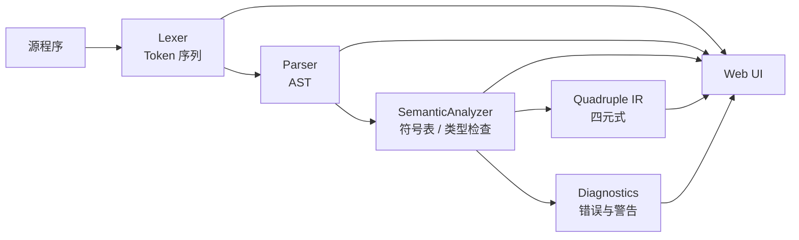
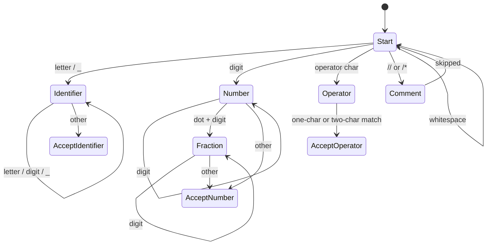

# 类 Rust 中间代码生成器

一个面向编译原理课程大作业 2 的类 Rust 编译前端。项目从源程序出发，完成词法分析、递归下降语法分析、静态语义检查，并生成四元式形式的中间代码；同时提供纯前端图形界面用于查看诊断、Token、AST、符号表和中间代码。

本项目采用 HTML + CSS + JavaScript 实现，无需安装第三方依赖，适合课程展示、报告截图和 GitHub 开源阅读。

## 目录

- [项目概述](#项目概述)
- [功能特性](#功能特性)
- [环境要求](#环境要求)
- [快速开始](#快速开始)
- [项目结构](#项目结构)
- [项目建构过程](#项目建构过程)
- [词法分析](#词法分析)
  - [Token 分类](#token-分类)
  - [DFA 设计](#dfa-设计)
  - [关键处理策略](#关键处理策略)
- [语法分析](#语法分析)
  - [文法规则覆盖](#文法规则覆盖)
  - [递归下降实现](#递归下降实现)
  - [表达式优先级](#表达式优先级)
  - [左递归消除](#左递归消除)
- [语义检查与中间代码](#语义检查与中间代码)
- [图形界面](#图形界面)
- [测试用例](#测试用例)
- [设计思考](#设计思考)
- [参考文献](#参考文献)

## 项目概述

课程要求是根据类 Rust 语义规则，对源程序给出语义分析结果，并生成中间代码，建议使用四元式。当前实现将编译流程拆成 5 个阶段：

1. 词法分析：把源程序扫描成 Token 序列。
2. 语法分析：用递归下降构造 AST。
3. 语义分析：维护函数表、作用域栈和符号表，检查类型、声明、赋值、返回、循环控制和借用规则。
4. 中间代码生成：在语义遍历过程中同步输出四元式。
5. 可视化展示：在浏览器中展示诊断、四元式、符号表、Token 和 AST。



## 功能特性

- 支持函数声明、参数、返回类型、语句块、空语句、返回语句。
- 支持变量声明、类型标注、类型推断、初始化、赋值和变量重影。
- 支持 `i32`、`bool`、数组、元组、不可变引用和可变引用。
- 支持整数、布尔字面量、变量、括号表达式、块表达式、函数调用。
- 支持算术、比较、一元负号、逻辑非、取引用和解引用。
- 支持 `if`、`else`、`else if`、`while`、`for start..end`、`loop`、`break`、`continue`。
- 支持 `if` 表达式、块尾表达式、`loop { break value; }` 表达式。
- 支持数组字面量、数组索引、元组字面量、元组成员访问与元素赋值。
- 输出 `FUNC`、`PARAM`、`DECL`、`ASSIGN`、算术/比较、`IF_FALSE`、`GOTO`、`LABEL`、`ARG`、`CALL`、`RETURN` 等四元式。
- 提供浏览器 UI，可直接查看诊断、四元式、符号表、Token 和 AST。

## 环境要求

- 浏览器：Chrome、Edge、Firefox 等现代浏览器。
- 运行测试：Node.js 18 或更高版本。
- 项目运行不需要 npm install，也没有构建步骤。

## 快速开始

直接双击打开 `index.html`，或在浏览器中打开该文件。

使用流程：

1. 在左侧编辑器输入类 Rust 源程序，或选择内置示例后点击“载入示例”。
2. 点击“编译分析”。
3. 在右侧切换查看“诊断”“四元式”“符号表”“Token”“AST”。

运行自动测试：

```bash
node tests/run-tests.js
```

如果终端提示 `node` 命令不存在，请先安装 Node.js，并确认它已经加入系统 `PATH`。

## 项目结构

```text
.
├── index.html                                  # 图形界面入口
├── styles.css                                  # 页面样式
├── compiler.js                                 # 词法、语法、语义、IR 生成和 UI 绑定
├── tests/
│   └── run-tests.js                            # 自动化回归测试
├── README.md                                   # 项目说明文档
└── 【Rust版】大作业2：中间代码生成器.pdf        # 课程任务书
```

## 项目建构过程

1. 需求抽取：从课程 PDF 中整理必做文法规则，包括 `0.1/0.2/0.3`、`1.1-1.5`、`2.0-2.2`、`3.1-3.5`、`4.1`、`5.0/5.1`。
2. 词法层搭建：实现单趟扫描器，识别关键字、标识符、字面量、运算符、界符和注释。
3. 语法层搭建：按非终结符拆分递归下降函数，并把表达式分层处理来保证优先级。
4. 语义层搭建：先收集函数签名，再逐函数遍历 AST，维护作用域栈和符号表。
5. 中间代码生成：语义遍历时即时发射四元式，避免再做一次单独 AST 遍历。
6. 扩展规则补充：加入不可变变量、引用/借用、数组、元组、块表达式、if 表达式和 loop 表达式。
7. 前端可视化：将编译结果渲染为多 Tab 面板，方便演示和调试。
8. 回归测试：将 PDF 中的正例、反例和扩展边界条件整理为 Node.js 自动测试。

## 词法分析

### Token 分类

| 类别 | 示例 | 说明 |
| --- | --- | --- |
| 关键字 | `fn`、`let`、`mut`、`return`、`if`、`else`、`while`、`for`、`loop`、`break`、`continue`、`true`、`false` | 由关键字表统一判定 |
| 标识符 | `main`、`value`、`sum_1` | 字母或下划线开头，后续可含数字 |
| 数字 | `0`、`123`、`0.1` | 整数字面量进入 `i32`，浮点字面量会被诊断为不支持 |
| 运算符 | `+`、`-`、`*`、`/`、`==`、`!=`、`<=`、`>=`、`..`、`&`、`!` | 包含一元、二元和范围运算 |
| 界符 | `{}`、`()`、`[]`、`;`、`,`、`:`、`.` | 用于结构化语法 |
| EOF | `<eof>` | 语法分析结束标记 |

### DFA 设计



### 关键处理策略

- 先跳过空白、行注释 `//` 和块注释 `/* ... */`。
- 对 `->`、`==`、`!=`、`<=`、`>=`、`..` 等双字符符号优先匹配，避免被拆成两个单字符。
- Token 记录行列号，后续语法错误和语义错误都能定位到源程序位置。
- 词法阶段只识别浮点字面量，是否支持由语义阶段给出明确诊断。

## 语法分析

### 文法规则覆盖

| 规则 | 要求 | 当前状态 |
| --- | --- | --- |
| 0.1 | `mut` 变量属性 | 已完成 |
| 0.2 | `i32` 类型 | 已完成，并扩展 `bool`、引用、数组、元组 |
| 0.3 | 左值和标识符元素 | 已完成，并扩展索引、成员、解引用 |
| 1.1-1.5 | 函数、语句块、空语句、return、参数、返回类型 | 已完成 |
| 2.0-2.2 | 变量声明、声明语句、赋值语句 | 已完成 |
| 3.1-3.5 | 基本表达式、比较、加减、乘除、函数调用 | 已完成 |
| 4.1 | if 选择结构 | 已完成 |
| 5.0-5.1 | 循环语句、while | 已完成 |
| 4.2-4.3 | else、else if | 扩展完成 |
| 5.2-5.4 | for、loop、break/continue | 扩展完成 |
| 6.1-6.4 | 不可变变量、引用、可变引用、解引用 | 扩展完成基础静态检查 |
| 7.0-7.4 | 块表达式、函数尾表达式、if 表达式、loop 表达式 | 扩展完成 |
| 8.1-8.3 | 数组类型、数组表达式、数组元素 | 扩展完成 |
| 9.1-9.3 | 元组类型、元组表达式、元组元素 | 扩展完成 |

### 递归下降实现

`compiler.js` 中的 `Parser` 将文法拆成一组清晰的解析函数，例如：

- `parseProgram`
- `parseFunction`
- `parseParam`
- `parseType`
- `parseBlock`
- `parseStatement`
- `parseExpression`
- `parseIfStatement`
- `parseWhileStatement`
- `parseForStatement`
- `parseLoopStatement`

这种写法直接对应课程给出的文法，便于调试和报告说明。

### 表达式优先级

表达式采用分层解析：

```text
parseExpression
└── parseComparison      < <= > >= == !=
    └── parseTerm        + -
        └── parseFactor  * /
            └── parseUnary
                └── parsePostfix
                    └── parsePrimary
```

因此 `1 + 2 * 3 < 10` 会先归约乘法，再归约加法，最后生成比较表达式。

### 左递归消除

课程文法中常见形式如：

```text
<加减表达式> -> <加减表达式> <加减运算符> <项>
```

递归下降不能直接处理左递归，因此实现中转换为循环：

```javascript
let expression = this.parseFactor();
while (this.check("+") || this.check("-")) {
  const op = this.advance();
  const right = this.parseFactor();
  expression = { type: "BinaryExpr", operator: op.value, left: expression, right };
}
```

这样既消除了左递归，又保持了左结合语义。

## 语义检查与中间代码

语义分析和中间代码生成由 `SemanticAnalyzer` 完成。它不是单纯遍历 AST 输出代码，而是在遍历过程中同步维护函数表、作用域栈、符号表、临时变量和标签，因此每一条四元式都能对应到已经通过检查的语义信息。

整体流程如下：

1. 收集函数签名：先扫描所有函数声明，记录函数名、形参类型、形参可变性和返回类型，并检查重复函数声明。
2. 分析函数体：逐个函数进入独立作用域，将形参加入符号表，再分析语句块。
3. 检查语义约束：对声明、赋值、表达式、函数调用、控制流和复合类型执行静态检查。
4. 生成四元式：在表达式求值、分支跳转、循环控制和函数调用处即时发射 IR。
5. 输出结果：返回诊断列表、符号表和四元式表，供命令行测试和浏览器 UI 共用。

### 语义检查内容

| 检查类别 | 实现内容 | 示例错误 |
| --- | --- | --- |
| 声明检查 | 变量必须先声明后使用；函数调用必须能在函数表中找到 | `变量 'a' 未声明` |
| 初始化检查 | 变量读取前必须已经赋值；无类型声明的变量必须能推断出类型 | `变量 'x' 使用前未赋值` |
| 类型检查 | 赋值、变量初始化、return、函数实参、数组/元组元素类型必须一致 | `赋值类型不一致` |
| 返回检查 | `return` 或函数尾表达式必须匹配函数声明返回类型 | `返回值类型不一致` |
| 条件检查 | `if`、`while` 的条件必须是 `bool` | `if 条件表达式必须是 bool` |
| 循环控制检查 | `break`、`continue` 必须在循环体内；`break value` 仅用于 `loop` 表达式 | `break 必须出现在循环体内` |
| 可变性检查 | 不带 `mut` 的变量、数组元素、元组元素不能二次赋值 | `变量不可变，不能被二次赋值` |
| 借用检查 | 多个不可变引用可共存；可变引用必须独占；可变引用只能来自可变变量 | `可变引用不能和其他引用共存` |
| 索引检查 | 数组索引必须是 `i32`；常量索引会检查越界；元组索引必须是整数字面量 | `数组索引必须在合法范围内` |

作用域由栈结构维护。进入函数、块表达式或 `for` 循环时压入新作用域，离开时弹出作用域，并释放该作用域内变量持有的引用借用。变量重影会隐藏当前作用域中旧的同名绑定，并释放旧绑定持有的借用；引用变量重新赋值时也会释放旧借用、登记新借用，使后续语义更接近类 Rust 的绑定规则。

### 类型推断与符号表

未标注类型的变量使用 `unknown` 暂存：

```rust
fn main() {
    let mut x;
    x = 1;
}
```

分析到 `x = 1` 时，右侧类型为 `i32`，于是将 `x` 推断为 `i32`。如果离开作用域时仍为 `unknown`，编译器会报告无法推断类型。

符号表中每个变量会记录：

- 源程序名称，例如 `x`。
- IR 名称，例如 `x#1`，用于区分重影变量。
- 所在作用域，例如 `fn main`、`block`、`for`。
- 符号类别，例如 `param`、`local`、`loop`。
- 类型、可变性、初始化状态、读写次数和源码位置。

### 四元式设计

中间代码采用四元式：

```text
(op, arg1, arg2, result)
```

其中 `op` 表示操作，`arg1` 和 `arg2` 表示操作数，`result` 表示结果位置、跳转标签或函数名。临时变量统一命名为 `_t1`、`_t2`，标签统一命名为 `L1`、`L2`。

常见四元式如下：

| 操作 | 含义 |
| --- | --- |
| `FUNC` / `END` | 函数开始与结束 |
| `PARAM` | 函数形参进入符号表 |
| `DECL` | 局部变量声明 |
| `ASSIGN` | 赋值 |
| `+`、`-`、`*`、`/` | 算术运算 |
| `<`、`<=`、`>`、`>=`、`==`、`!=` | 比较运算，结果为 `bool` |
| `NEG`、`NOT` | 一元负号和逻辑非 |
| `IF_FALSE` | 条件为假时跳转 |
| `GOTO` / `LABEL` | 无条件跳转与标签 |
| `ARG` / `CALL` | 函数实参传递与函数调用 |
| `RETURN` | 函数返回 |
| `ARRAY` / `INDEX` | 数组构造与数组取元素 |
| `TUPLE` / `MEMBER` | 元组构造与元组取成员 |
| `REF` / `REF_MUT` / `DEREF` | 不可变引用、可变引用和解引用 |

### 生成示例

源程序：

```rust
fn add(mut a:i32, mut b:i32) -> i32 {
    return a + b;
}
```

可能生成：

```text
(FUNC,   ,    , add)
(PARAM, i32,  , a#1)
(PARAM, i32,  , b#2)
(+,     a#1, b#2, _t1)
(RETURN,_t1,  , )
(END,    ,    , add)
```

对于控制流，编译器使用标签和跳转表达分支与循环：

```rust
fn main(mut x:i32) {
    while x > 0 {
        x = x - 1;
    }
}
```

核心四元式形态如下：

```text
(LABEL,    ,    , L1)
(>,     x#1, 0, _t1)
(IF_FALSE,_t1,  , L2)
(-,     x#1, 1, _t2)
(ASSIGN,_t2,  , x#1)
(GOTO,     ,    , L1)
(LABEL,    ,    , L2)
```

## 图形界面

界面由 `index.html` 和 `styles.css` 提供，`compiler.js` 在浏览器中暴露 `RustLikeCompiler` 对象并绑定 UI 事件。

主要视图：

- 源程序编辑区：支持 Tab 缩进和 `Ctrl + Enter` 编译。
- 示例选择：内置基础通过、函数与 if、语义错误、break/continue、数组和元组扩展示例。
- 诊断面板：显示词法、语法、语义错误与警告。
- 四元式面板：表格展示 IR。
- 符号表面板：展示变量作用域、类型、可变性和初始化状态。
- Token 面板：展示词法扫描结果。
- AST 面板：展示 JSON 形式语法树。

## 测试用例

`tests/run-tests.js` 覆盖以下类别：

- 必做规则正例：函数、空语句、return、参数、返回值、声明、赋值、表达式、函数调用、if、while。
- 必做规则反例：未声明变量、使用前未赋值、返回类型不一致、赋值类型不一致、函数实参数量不一致、循环外 break。
- 扩展规则正例：for、loop、loop 表达式、数组、元组、引用、解引用。
- 扩展规则反例：不可变变量二次赋值、数组越界、元组越界、数组/元组类型不一致、引用冲突、不可变引用写入。

执行：

```bash
node tests/run-tests.js
```

通过时输出：

```text
All compiler checks passed.
```

## 设计思考

- 将四元式生成放在语义分析阶段，可以复用类型信息、符号表和临时变量，降低二次遍历 AST 的复杂度。
- 表达式优先级使用分层递归下降实现，比手写统一表达式解析更容易对应课程文法。
- 变量重影通过“当前作用域 Map 覆盖 + 作用域栈向外查找”实现，符合类 Rust 的绑定隐藏直觉。
- 引用检查只实现课程要求的静态近似规则，没有实现完整 Rust 生命周期系统；这样更适合课程项目范围。
- UI 保持纯前端，避免环境配置成本；测试仍通过 Node.js 复用同一个 `compile` API，保证浏览器和命令行行为一致。

## 参考文献

- 课程任务书：[《大作业2：中间代码生成器》](./【Rust版】大作业2：中间代码生成器.pdf)
- Alfred V. Aho, Monica S. Lam, Ravi Sethi, Jeffrey D. Ullman. *Compilers: Principles, Techniques, and Tools*.
- Rust 官方文档：The Rust Programming Language.
- Rust Reference：Expressions、Statements、Types、Borrowing 相关章节。
